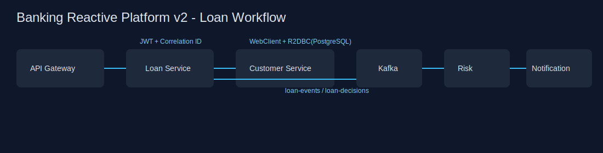
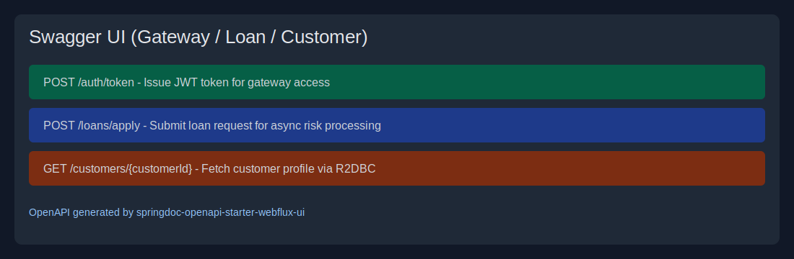

# Banking Reactive Platform v2

[](https://adoptium.net/)
[](https://spring.io/projects/spring-boot)
[](https://github.com/kimchinuk/banking-reactive-platform/actions/workflows/maven-ci.yml)
[](k8s/banking-reactive-platform.yaml)

Production-style reactive microservices platform demonstrating secure gateway access, resilient service calls, event-driven processing, modern observability, and cloud-native deployment assets.

## Resume-ready highlights

- **Reactive stack:** Spring WebFlux + WebClient + Kafka + Spring Cloud Gateway
- **Security:** Spring Security + JWT-secured gateway endpoints
- **Data:** PostgreSQL + Spring Data R2DBC in customer-service
- **Reliability:** Resilience4j CircuitBreaker + Retry + Bulkhead + RateLimiter
- **API docs:** OpenAPI/Swagger UI for gateway, customer-service, loan-service, and payment-service
- **Payment domain:** dedicated payment-service covering transaction analytics, fee rules, debugging fix, and theory Q&A
- **Frontend:** Angular payment UI for transaction input/output, theory view, and API integration
- **Observability:** centralized correlation ID logging + OpenTelemetry tracing export
- **Testing:** Testcontainers integration tests with real PostgreSQL
- **Delivery:** GitHub Actions verify pipeline + Docker build matrix
- **Platform ops:** Kubernetes deployment manifests under `k8s/`

## System architecture

See [docs/architecture.md](docs/architecture.md) for HLD/LLD diagrams.

## Screenshots




## Services and ports

| Service | Port | Responsibility |
|---|---:|---|
| api-gateway | 8080 | JWT auth, routing, edge observability |
| customer-service | 8081 | Reactive customer profile lookup via PostgreSQL/R2DBC |
| loan-service | 8082 | Loan intake and resilient customer validation |
| payment-service | 8085 | Payment transaction analytics, fee calculator, debugging and theory APIs |
| payment-ui | 4200 | Angular UI for payment-service input/output |
| risk-service | 8083 | Async risk decisioning from Kafka events |
| notification-service | 8084 | Async notification dispatch |

## Quick start (Docker Compose)

```bash
docker compose up --build
```

## API usage

1. Get JWT from gateway:
```bash
curl -X POST http://localhost:8080/auth/token \
  -H "Content-Type: application/json" \
  -d '{"subject":"resume-demo-user"}'
```
2. Submit loan with JWT:
```bash
curl -X POST http://localhost:8080/api/loans/apply \
  -H "Authorization: Bearer <access_token>" \
  -H "X-Correlation-Id: demo-correlation-001" \
  -H "Content-Type: application/json" \
  -d '{"customerId":"CUST-1001","amount":25000,"termMonths":36,"purpose":"HOME_IMPROVEMENT"}'
```

## Swagger/OpenAPI endpoints

- Gateway docs: `http://localhost:8080/swagger-ui.html`
- Customer docs: `http://localhost:8081/swagger-ui.html`
- Loan docs: `http://localhost:8082/swagger-ui.html`
- Payment docs: `http://localhost:8085/swagger-ui.html`

## Payment service scenario and coding endpoints

1. Average transaction amount per account
```bash
curl -X POST http://localhost:8080/api/payments/analytics/average \
  -H "Authorization: Bearer <access_token>" \
  -H "Content-Type: application/json" \
  -d '[{"transactionId":"T1","accountId":"ACC-1","amount":100.0,"type":"CREDIT"},{"transactionId":"T2","accountId":"ACC-1","amount":50.0,"type":"DEBIT"}]'
```
2. Total transaction fee per account (Credit=$1, Debit=$2)
```bash
curl -X POST http://localhost:8080/api/payments/fees/total \
  -H "Authorization: Bearer <access_token>" \
  -H "Content-Type: application/json" \
  -d '[{"transactionId":"T1","accountId":"ACC-1","amount":100.0,"type":"CREDIT"},{"transactionId":"T2","accountId":"ACC-1","amount":50.0,"type":"DEBIT"}]'
```
3. Theoretical answers API
```bash
curl -X GET http://localhost:8080/api/payments/theory \
  -H "Authorization: Bearer <access_token>"
```

4. Angular UI
```bash
http://localhost:4200
```

## Payment transaction design notes

- **Dependency Injection:** services depend on abstractions/strategies (`TransactionFeePolicy`) and are wired by Spring.
- **Testability principles:** SRP + DIP + pure functions for aggregation logic.
- **Maintainability refactor:** isolate mapping, orchestration, fee strategy, and validation into focused classes.
- **If-else elimination:** Strategy pattern replaces type condition chains for fee calculation.
- **equals/hashCode relation:** `Transaction` implements both consistently for map/set correctness.
- **Debugging exercise fix:** validator now uses `BigDecimal.compareTo()` for numeric validity checks.
- **Heap generations:** young (Eden/Survivor) to old generation via GC age/promotion.
- **Java exceptions:** specific exception mapping is centralized in `GlobalExceptionHandler`.

## Kubernetes

Apply all manifests:

```bash
kubectl apply -f k8s/banking-reactive-platform.yaml
```

## CI/CD

`.github/workflows/maven-ci.yml` now runs:

- full Maven `clean verify` (including Testcontainers integration tests)
- artifact upload for test reports
- Docker build matrix for all deployable services (including payment-ui)
- Angular unit tests for `payment-ui`

## Payment UI local development

```bash
cd payment-ui
npm install
npm start
```

### Payment UI unit tests

```bash
npm test
```

From the repository root, `npm test` forwards to `payment-ui/` so you do not need to `cd` first.