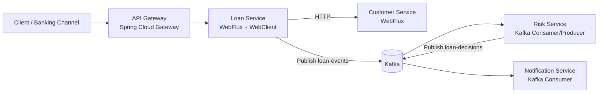
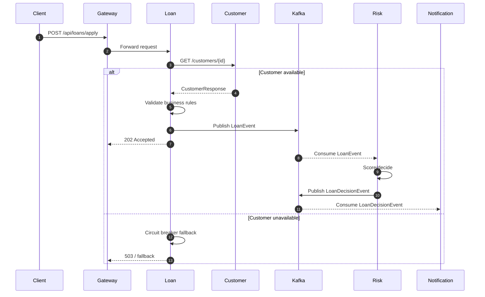

# Architecture (HLD / LLD)

## High-Level Design (HLD)

### HLD explanation

- **API Gateway** centralizes routing and is the future home for authentication, rate limiting, and correlation IDs.
- **Loan Service** owns synchronous input handling and business orchestration.
- **Customer Service** is a backing reference-data service.
- **Kafka** decouples the request path from downstream risk and notification processing.
- **Risk Service** can scale independently and evolve without changing the entry API.
- **Notification Service** represents downstream side effects such as email/SMS/push.

## Low-Level Design (LLD)

## Spring technology notes

### Spring WebFlux
Used for non-blocking request handling and reactive composition with `Mono`. This reduces the cost of waiting on I/O during heavy concurrency.

### Spring WebClient
Used by the Loan Service so downstream HTTP calls do not block request threads.

### Spring Cloud Gateway
Provides a reactive API gateway at the platform edge.

### Spring Kafka
Implements event-driven communication between services.

### Resilience4j Circuit Breaker
Protects the Loan Service from latency amplification and repeated failures when Customer Service is unavailable.
